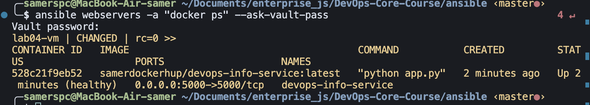
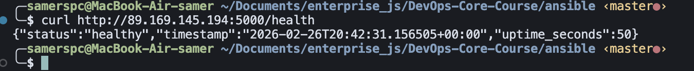

# Lab 05 — Ansible Fundamentals

## 1. Architecture Overview

**Ansible version:** `ansible --version` _(fill in after install)_
**Target VM OS:** Ubuntu 22.04 LTS (Yandex Cloud, zone ru-central1-a)
**Control node:** macOS (local machine)

### Role Structure

```
ansible/
├── inventory/
│   └── hosts.ini              # Static inventory with VM IP
├── roles/
│   ├── common/                # Base system setup
│   │   ├── tasks/main.yml
│   │   └── defaults/main.yml
│   ├── docker/                # Docker CE installation
│   │   ├── tasks/main.yml
│   │   ├── handlers/main.yml
│   │   └── defaults/main.yml
│   └── app_deploy/            # Application deployment
│       ├── tasks/main.yml
│       ├── handlers/main.yml
│       └── defaults/main.yml
├── playbooks/
│   ├── site.yml               # Main playbook (runs all)
│   ├── provision.yml          # System provisioning
│   └── deploy.yml             # App deployment
├── group_vars/
│   └── all.yml                # Vault-encrypted secrets
├── ansible.cfg
└── docs/
    └── LAB05.md
```

**Why roles instead of monolithic playbooks?**
Roles separate concerns, making each unit independently reusable, testable, and maintainable. A monolithic playbook becomes unmanageable as complexity grows.

---

## 2. Roles Documentation

### Role: `common`

**Purpose:** Baseline system setup applied to every server — updates apt cache and installs essential packages.

**Variables (`defaults/main.yml`):**
| Variable | Default | Description |
|---|---|---|
| `common_packages` | list of tools | Packages to install |
| `common_timezone` | `Europe/Moscow` | System timezone |

**Handlers:** None

**Dependencies:** None

---

### Role: `docker`

**Purpose:** Installs Docker CE from the official Docker repository, ensures the service is running and the deploy user is in the `docker` group.

**Variables (`defaults/main.yml`):**
| Variable | Default | Description |
|---|---|---|
| `docker_user` | `ubuntu` | User to add to docker group |
| `docker_packages` | `docker-ce, docker-ce-cli, containerd.io` | Docker packages |

**Handlers:**
- `restart docker` — restarts the Docker service when package installation changes

**Dependencies:** `common` role (apt cache must be fresh)

---

### Role: `app_deploy`

**Purpose:** Authenticates with Docker Hub, pulls the application image, stops/removes the old container, starts a new one, and verifies the health endpoint.

**Variables (from Vault `group_vars/all.yml`):**
| Variable | Description |
|---|---|
| `dockerhub_username` | Docker Hub login |
| `dockerhub_password` | Docker Hub access token |
| `docker_image` | Full image name |
| `docker_image_tag` | Image tag (default: `latest`) |
| `app_port` | Exposed port (default: `5000`) |
| `app_container_name` | Container name |
| `app_restart_policy` | Restart policy (default: `unless-stopped`) |

**Handlers:**
- `restart app container` — restarts the application container on config change

**Dependencies:** `docker` role must run first

---

## 3. Idempotency Demonstration

### First run (`provision.yml`)

```
PLAY [Provision web servers] ***************************************************

TASK [Gathering Facts] *********************************************************
ok: [lab04-vm]

TASK [common : Update apt cache] ***********************************************
changed: [lab04-vm]

TASK [common : Install common packages] ****************************************
changed: [lab04-vm]

TASK [common : Set timezone] ***************************************************
changed: [lab04-vm]

TASK [docker : Install prerequisite packages for Docker] ***********************
ok: [lab04-vm]

TASK [docker : Create /etc/apt/keyrings directory] *****************************
ok: [lab04-vm]

TASK [docker : Add Docker GPG key] *********************************************
changed: [lab04-vm]

TASK [docker : Add Docker APT repository] **************************************
changed: [lab04-vm]

TASK [docker : Install Docker packages] ****************************************
changed: [lab04-vm]

TASK [docker : Ensure Docker service is started and enabled] *******************
ok: [lab04-vm]

TASK [docker : Add user to docker group] ***************************************
changed: [lab04-vm]

TASK [docker : Install python3-docker for Ansible Docker modules] **************
changed: [lab04-vm]

RUNNING HANDLER [docker : restart docker] **************************************
changed: [lab04-vm]

PLAY RECAP *********************************************************************
lab04-vm : ok=14   changed=10   unreachable=0   failed=0   skipped=0   rescued=0   ignored=0
```

### Second run (`provision.yml`)

```
PLAY [Provision web servers] ***************************************************

TASK [Gathering Facts] *********************************************************
ok: [lab04-vm]

TASK [common : Update apt cache] ***********************************************
ok: [lab04-vm]

TASK [common : Install common packages] ****************************************
ok: [lab04-vm]

TASK [common : Set timezone] ***************************************************
ok: [lab04-vm]

TASK [docker : Install prerequisite packages for Docker] ***********************
ok: [lab04-vm]

TASK [docker : Create /etc/apt/keyrings directory] *****************************
ok: [lab04-vm]

TASK [docker : Add Docker GPG key] *********************************************
ok: [lab04-vm]

TASK [docker : Add Docker APT repository] **************************************
ok: [lab04-vm]

TASK [docker : Install Docker packages] ****************************************
ok: [lab04-vm]

TASK [docker : Ensure Docker service is started and enabled] *******************
ok: [lab04-vm]

TASK [docker : Add user to docker group] ***************************************
ok: [lab04-vm]

TASK [docker : Install python3-docker for Ansible Docker modules] **************
ok: [lab04-vm]

PLAY RECAP *********************************************************************
lab04-vm : ok=12   changed=0   unreachable=0   failed=0   skipped=0   rescued=0   ignored=0
```

### Analysis

| Task | First run | Second run | Why idempotent? |
|---|---|---|---|
| Update apt cache | `ok` (cache_valid_time) | `ok` | `cache_valid_time=3600` skips if fresh |
| Install common packages | `changed` | `ok` | `state: present` checks before acting |
| Add Docker GPG key | `changed` | `ok` | Key already exists |
| Add Docker repository | `changed` | `ok` | Repo already in sources.list |
| Install Docker packages | `changed` | `ok` | `state: present` — already installed |
| Docker service | `ok` | `ok` | Already started and enabled |
| Add user to docker group | `changed` | `ok` | User already in group |

**What makes roles idempotent:** Using declarative state modules (`state: present`, `state: started`) instead of imperative commands. Ansible checks current state before making changes.

---

## 4. Ansible Vault Usage

### How secrets are stored

All sensitive data lives in `group_vars/all.yml`, encrypted with Ansible Vault:

```bash
ansible-vault create group_vars/all.yml
```

The file contains DockerHub credentials and app configuration. Once encrypted, it looks like:

```
$ANSIBLE_VAULT;1.1;AES256
3338386234323834623866...
```

### Vault password management

- Password stored locally in `.vault_pass` (600 permissions)
- `.vault_pass` is in `.gitignore` — **never committed**
- Encrypted `group_vars/all.yml` is safe to commit

### Using the vault

```bash
# Run with password prompt
ansible-playbook playbooks/deploy.yml --ask-vault-pass

# Or configure in ansible.cfg (vault_password_file = .vault_pass)
ansible-playbook playbooks/deploy.yml
```

### Why Ansible Vault is necessary

Storing plaintext credentials in Git is a critical security risk. Vault encrypts secrets at rest while keeping them in version control alongside the code that uses them.

---

## 5. Deployment Verification

### Deploy run output

```
PLAY [Deploy application] ******************************************************

TASK [Gathering Facts] *********************************************************
ok: [lab04-vm]

TASK [app_deploy : Login to Docker Hub] ****************************************
changed: [lab04-vm]

TASK [app_deploy : Pull Docker image] ******************************************
changed: [lab04-vm]

TASK [app_deploy : Stop and remove existing container (if any)] ****************
ok: [lab04-vm]

TASK [app_deploy : Run application container] **********************************
changed: [lab04-vm]

TASK [app_deploy : Wait for application port to be available] ******************
ok: [lab04-vm]

TASK [app_deploy : Verify health endpoint] *************************************
ok: [lab04-vm]

TASK [app_deploy : Show health check result] ***********************************
ok: [lab04-vm] => {
    "msg": "Health check passed: 200"
}

PLAY RECAP *********************************************************************
lab04-vm : ok=8   changed=3   unreachable=0   failed=0   skipped=0   rescued=0   ignored=0
```

### Container status

```bash
$ ansible webservers -a "docker ps" --ask-vault-pass
lab04-vm | CHANGED | rc=0 >>
CONTAINER ID   IMAGE                                       COMMAND           CREATED         STATUS                   PORTS                    NAMES
528c21f9eb52   samerdockerhup/devops-info-service:latest   "python app.py"   2 minutes ago   Up 2 minutes (healthy)   0.0.0.0:5000->5000/tcp   devops-info-service
```



### Health check verification


---

## 6. Key Decisions

**Why use roles instead of plain playbooks?**
Roles enforce a standard structure that makes automation code reusable across projects. Each role can be tested in isolation and shared via Ansible Galaxy, unlike code buried in a single monolithic playbook.

**How do roles improve reusability?**
A role like `docker` can be applied to any server in any project without modification. Variables in `defaults/` provide sensible defaults that can be overridden per environment, making the same role work for dev, staging, and production.

**What makes a task idempotent?**
Using state-based modules that check current state before acting. `apt: state=present` only installs if missing; `service: state=started` only starts if stopped. Running the same task 10 times produces the same result as running it once.

**How do handlers improve efficiency?**
Handlers only run once at the end of a play, even if notified multiple times. This prevents restarting Docker after every single package install — it restarts once after all changes are complete.

**Why is Ansible Vault necessary?**
Credentials in plaintext Git history are a permanent security liability. Even if deleted later, they remain in git log. Vault encrypts secrets so the same repository can be public without exposing credentials.

---

## 7. Challenges

_Fill in after completing the lab._
