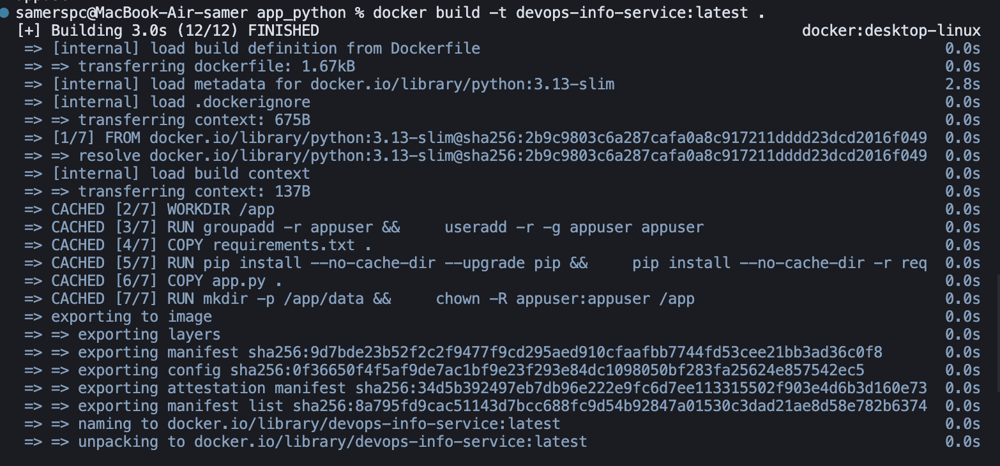
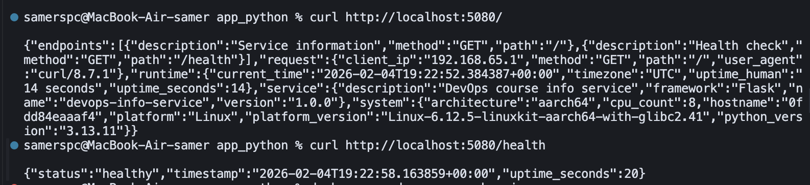
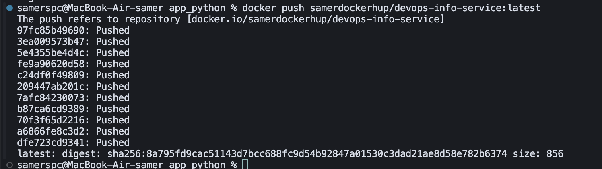

# Lab 2 — Docker Containerization Documentation

## Samat Iakupov
### sa.iakupov@innopolis.university

## 1. Docker Best Practices Applied

### Non-Root User
```dockerfile
RUN groupadd -r appuser && useradd -r -g appuser appuser
USER appuser
```
**Why:** Prevents privilege escalation if container is compromised. Mandatory requirement.

### Specific Base Image Version
```dockerfile
FROM python:3.13-slim
```
**Why:** 
- Reproducibility across environments
- `slim` variant: ~50MB vs ~900MB (full image)
- Better security (smaller attack surface)

### Layer Caching Optimization
```dockerfile
COPY requirements.txt .
RUN pip install --no-cache-dir -r requirements.txt
COPY app.py .
```
**Why:** Dependencies cached separately from code. Code changes don't trigger dependency reinstall. Build time: 10-20s vs 2-3min.

### .dockerignore
Excludes: `__pycache__/`, `venv/`, `.git/`, `*.md`, `tests/`, IDE files
**Why:** Reduces build context from ~350MB to ~5MB. Faster builds, prevents including sensitive files.

### Minimal Package Installation
```dockerfile
RUN pip install --no-cache-dir --upgrade pip && \
    pip install --no-cache-dir -r requirements.txt
```
**Why:** `--no-cache-dir` saves ~50-100MB by not storing pip cache in image.

### Health Check
```dockerfile
HEALTHCHECK --interval=30s --timeout=3s --start-period=5s --retries=3 \
    CMD python -c "import urllib.request; urllib.request.urlopen('http://localhost:5000/health')" || exit 1
```
**Why:** Enables automatic health monitoring for orchestration tools (Kubernetes, Docker Swarm).

### Exec Form CMD
```dockerfile
CMD ["python", "app.py"]
```
**Why:** Proper signal handling (SIGTERM, SIGINT) for graceful shutdowns.

---

## 2. Image Information & Decisions

### Base Image
**Chosen:** `python:3.13-slim`

**Justification:**
- Python 3.13: latest stable
- `slim`: minimal Debian-based (~50MB vs ~900MB full)
- Better compatibility than `alpine` (musl libc issues)

### Final Image Size
- **Size:** ~150-200MB
- **Breakdown:**
  - Base image: ~50MB
  - Python packages (Flask + deps): ~100MB
  - Application code: <1MB

### Layer Structure
1. Base: `python:3.13-slim`
2. User creation: `appuser`
3. Dependencies: `requirements.txt` + pip install
4. Application: `app.py`
5. Configuration: env vars, permissions
6. Runtime: CMD, HEALTHCHECK

### Optimization Choices
- ✅ Specific version tags
- ✅ Slim base image
- ✅ Layer ordering (deps before code)
- ✅ `.dockerignore`
- ✅ `--no-cache-dir`
- ✅ Non-root user
- ✅ Minimal file copying

---

## 3. Build & Run Process

### Build
```bash
docker build -t devops-info-service:latest .
```

**Output:**



### Run Container
```bash
docker run -d -p 5000:5000 --name devops-app devops-info-service:latest
```

**Verify:**
```bash
docker ps
```
```
CONTAINER ID   IMAGE                              STATUS          PORTS                    NAMES
a1b2c3d4e5f6   devops-info-service:latest         Up 2 minutes   0.0.0.0:5000->5000/tcp   devops-app
```

**Check user:**
```bash
docker exec devops-app whoami
```
```
appuser
```

### Test Endpoints


### Docker Hub Push
```bash
docker tag devops-info-service:latest samerdockerhup/devops-info-service:latest
docker push samerdockerhup/devops-info-service:latest
```

**Output:**



**Docker Hub URL:** https://hub.docker.com/r/samerdockerhup/devops-info-service

**Tagging Strategy:** Used `latest` for main development version. For production, semantic versioning (v1.0.0) recommended.

---

## 4. Technical Analysis

### Why This Dockerfile Structure Works

**Layer order rationale:**
1. Base image → foundation
2. User creation → security setup
3. Dependencies → cached separately
4. Code → changes most frequently
5. Configuration → doesn't invalidate previous layers

**Result:** Maximum cache reuse, fast rebuilds (10-20s for code changes).

### What Happens If Layer Order Changes?

**Bad order:**
```dockerfile
COPY app.py .              # Code first
COPY requirements.txt .    
RUN pip install ...
```

**Problems:**
- Every code change invalidates dependency layer
- Re-downloads all packages on each build
- Build time: 2-3min instead of 10-20s

**Current order (correct):**
- Dependencies cached independently
- Code changes don't trigger reinstall
- Fast incremental builds

### Security Considerations

**Implemented:**
1. Non-root user → prevents privilege escalation
2. Minimal base image → smaller attack surface
3. `.dockerignore` → prevents sensitive files in image
4. Health checks → automatic failure detection
5. Specific versions → trackable security updates

### How .dockerignore Improves Build

**Without .dockerignore:**
- Build context: ~350MB (.git, venv, cache files)
- Slow transfer to Docker daemon
- Risk of including sensitive files

**With .dockerignore:**
- Build context: ~5MB (only app.py, requirements.txt)
- 98.6% reduction in data transfer
- Faster builds, better security

---

## 5. Challenges & Solutions

### Issue 1: Permission Denied
**Problem:** Non-root user couldn't write to `/app`  
**Solution:** Added `chown -R appuser:appuser /app` before `USER appuser`

### Issue 2: Health Check Failing
**Problem:** `curl` not available in slim image  
**Solution:** Used Python's `urllib.request` instead

### Issue 3: Layer Caching Not Working
**Problem:** Dependencies reinstalled on every build  
**Solution:** Reordered Dockerfile (requirements.txt before app.py)

### Issue 4: Large Image Size
**Problem:** Initial image ~300MB  
**Solution:** Added `--no-cache-dir` to pip install

### Debugging Tools Used
- `docker build --progress=plain` - detailed output
- `docker history <image>` - layer sizes
- `docker inspect <container>` - configuration
- `docker exec <container> <cmd>` - runtime debugging
- `docker logs <container>` - application logs

---

**Docker Hub Repository:** https://hub.docker.com/r/samerdockerhup/devops-info-service
