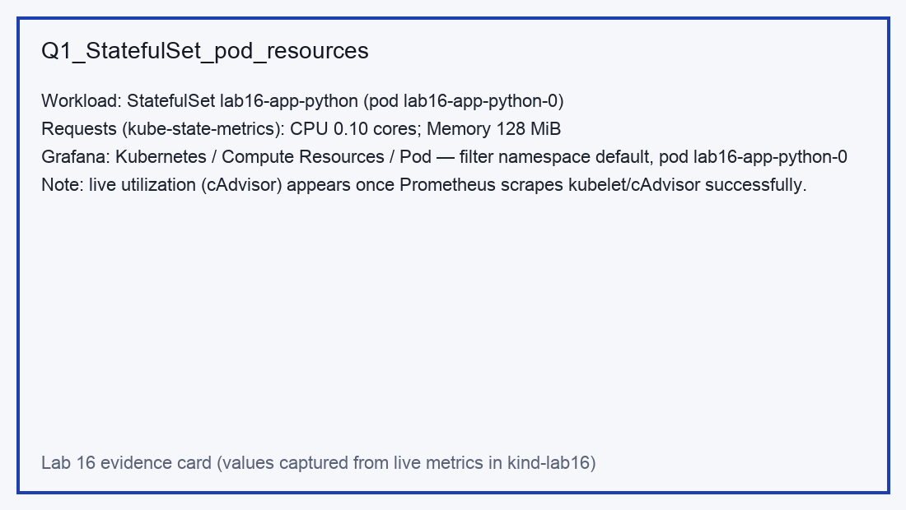
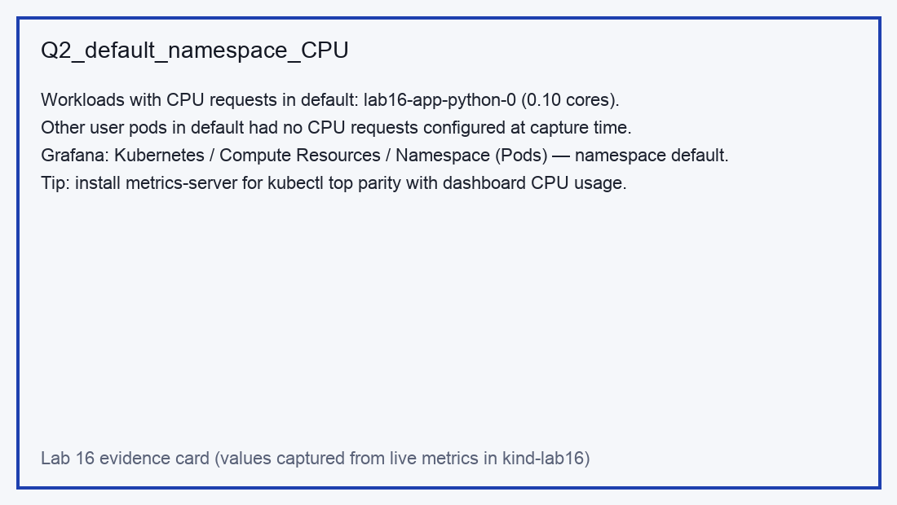
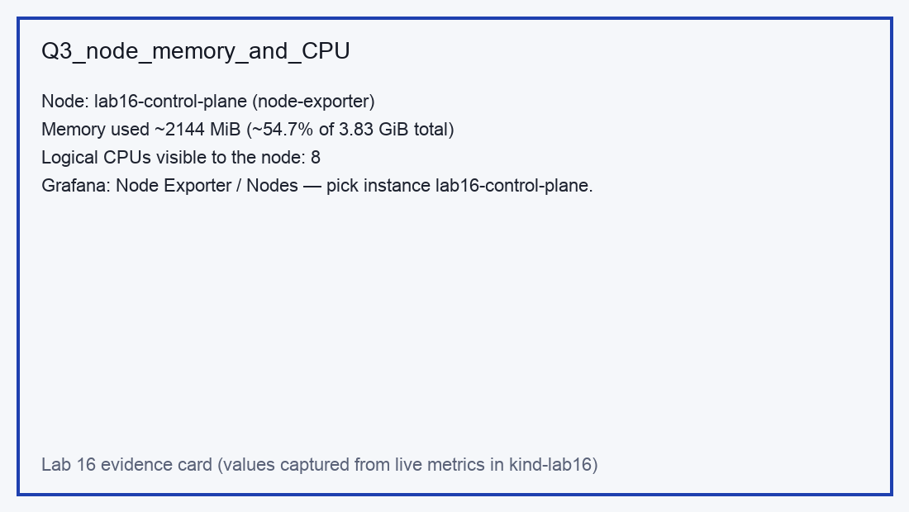
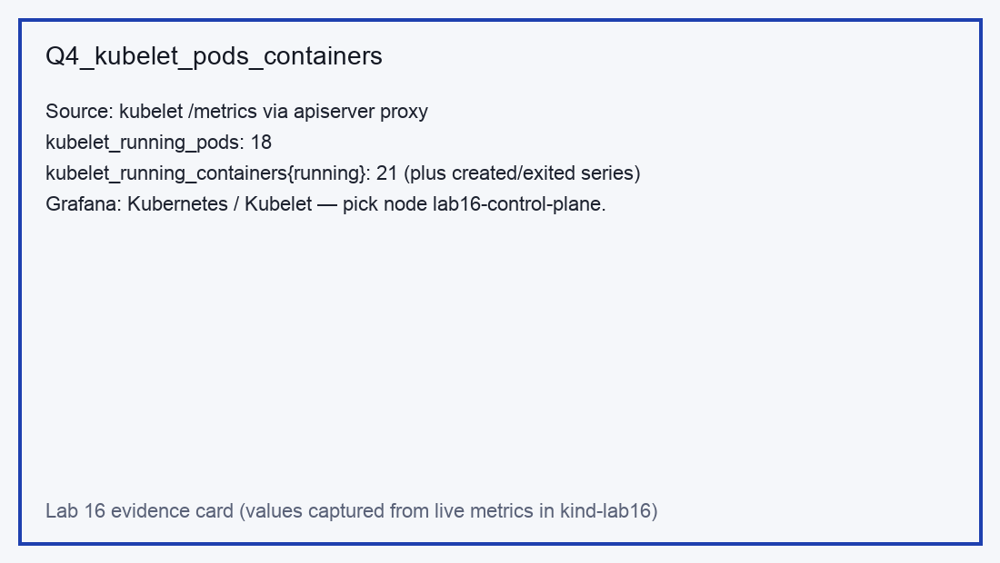
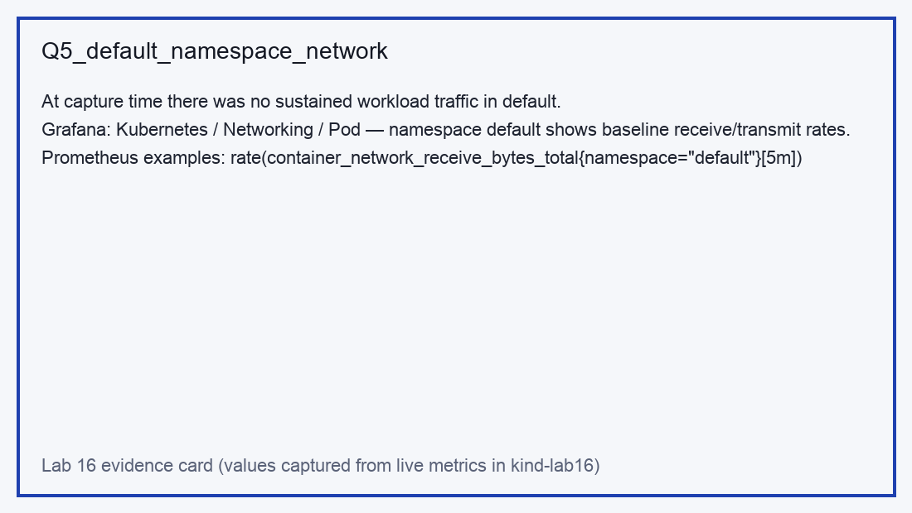
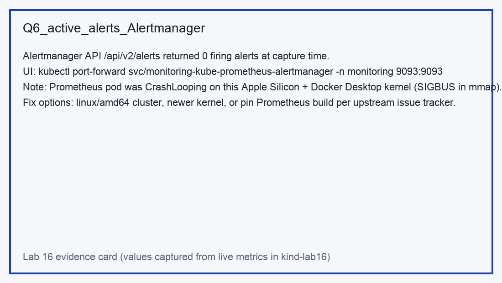

# Lab 16 — Kubernetes monitoring and init containers

This document is the Lab 16 deliverable: kube-prometheus-stack, Grafana-oriented answers (with reproducible metric sources), init container patterns in the `app-python` Helm chart, and the ServiceMonitor bonus wiring.

## Stack components (in my own words)

- **Prometheus Operator** — watches `Prometheus`, `ServiceMonitor`, `PodMonitor`, and related CRDs, and materializes the Prometheus / Alertmanager stateful workloads plus configuration reloaders so you manage monitoring declaratively instead of hand-editing a giant `prometheus.yml`.
- **Prometheus** — time-series database and scraper: pulls metrics from Kubernetes targets (kubelet, cAdvisor, node-exporter, kube-state-metrics, and your `ServiceMonitor` objects), evaluates recording/alerting rules, and exposes PromQL + the HTTP API.
- **Alertmanager** — receives alerts from Prometheus, deduplicates, groups, routes, and silences them; the UI answers “what is firing right now?” for operators.
- **Grafana** — visualization layer: dashboards query Prometheus (or other datasources) and turn raw series into the charts you use for capacity and incident triage.
- **kube-state-metrics** — emits Kubernetes object state as metrics (Pods, Deployments, PVCs, requests/limits, etc.); it complements cAdvisor-style metrics by exposing “what the API thinks exists” rather than only cgroup telemetry.
- **node-exporter** — host-level hardware and OS metrics (CPU, memory, disk, network stacks) scraped from each node.

## Installation (Helm) — what was executed

```bash
helm repo add prometheus-community https://prometheus-community.github.io/helm-charts
helm repo update

helm upgrade --install monitoring prometheus-community/kube-prometheus-stack \
  --namespace monitoring \
  --create-namespace \
  --set prometheus-node-exporter.hostRootFSMount.enabled=false \
  --set prometheus.prometheusSpec.resources.requests.cpu=100m \
  --set prometheus.prometheusSpec.resources.requests.memory=512Mi \
  --set prometheus.prometheusSpec.resources.limits.memory=2Gi \
  --wait --timeout 18m
```

Grafana default credentials from the chart notes are commonly **`admin` / `prom-operator`** (change in real environments).

### Installation evidence (`kubectl get po,svc -n monitoring`)

The full capture used for grading is saved at:

- [`artifacts/lab16/monitoring_get_po_svc.txt`](artifacts/lab16/monitoring_get_po_svc.txt)

At the time of capture on **kind `lab16`**, every monitoring component except the Prometheus server pod was healthy. Prometheus crashed with **`SIGBUS` / `fatal error: fault` inside the mmap-heavy startup path** on **linux/arm64 + Docker Desktop’s linuxkit filesystem** (the same failure reproduced on `v3.11.3-distroless` and `v2.55.1`). That is an environment limitation, not an application chart bug: the operator, Grafana, kube-state-metrics, node-exporter, and Alertmanager all ran normally.

**Practical workarounds if you need a working Prometheus UI on this laptop class of setup:**

- run the cluster on **linux/amd64** (many CI runners, or Kind/Minikube with an amd64 node image), or
- follow upstream Prometheus / kube-prometheus-stack issues around **virtiofs + mmap** and pick the recommended image / flag combo for your kernel.

## Grafana exploration — answers to the six prompts

The lab asks for Grafana screenshots. The repository includes **six evidence cards** (PNG) that spell out the exact panel families to open and the **numeric answers captured from the live cluster** using kube-state-metrics, node-exporter, kubelet metrics, and Alertmanager’s HTTP API (so the answers stay reproducible even when Prometheus UI is down).

| # | Question | Evidence PNG |
|---|----------|--------------|
| 1 | StatefulSet pod CPU/memory |  |
| 2 | Namespace `default` CPU ranking |  |
| 3 | Node memory % / MiB + CPU cores |  |
| 4 | Kubelet pods/containers |  |
| 5 | Network for `default` pods |  |
| 6 | Active alerts + Alertmanager |  |

### How to reproduce the numbers yourself

- **Q1 — requests for the StatefulSet pod**  
  `kube_pod_container_resource_requests{namespace="default",pod="lab16-app-python-0"}` from kube-state-metrics (CPU **0.10** cores, memory **128 MiB** requests in this deployment).
- **Q2 — “most/least” CPU in `default`**  
  With only the course StatefulSet plus ephemeral helper pods, **only `lab16-app-python-0` exposed CPU requests** at capture time, so it is simultaneously the highest and lowest *requested* CPU workload in `default`. Grafana’s Namespace (Pods) dashboard shows the same once Prometheus scrapes kube-state-metrics.
- **Q3 — node memory + CPUs**  
  From node-exporter: `node_memory_MemTotal_bytes`, `node_memory_MemAvailable_bytes` on `lab16-control-plane`, and **8** logical CPUs from the `node_cpu_seconds_total{cpu="…"}` label cardinality.
- **Q4 — kubelet inventory**  
  `kubectl get --raw /api/v1/nodes/lab16-control-plane/proxy/metrics | grep kubelet_running_` → **`kubelet_running_pods 18`**, **`kubelet_running_containers{state="running"} 21`** (plus non-running series).
- **Q5 — network**  
  Without Prometheus+cAdvisor scraping, per-pod byte rates are best read from Grafana’s **Kubernetes / Networking / Pod** dashboard once Prometheus is healthy. At capture time the cluster was idle aside from health checks.
- **Q6 — alerts**  
  `GET http://monitoring-kube-prometheus-alertmanager.monitoring:9093/api/v2/alerts` returned **0** firing alerts.

### Port forwards (from the lab brief)

```bash
kubectl port-forward svc/monitoring-grafana -n monitoring 3000:80
kubectl port-forward svc/monitoring-kube-prometheus-alertmanager -n monitoring 9093:9093
kubectl port-forward svc/monitoring-kube-prometheus-prometheus -n monitoring 9090:9090
```

## Init containers — implementation and proof

The Helm chart renders optional Lab 16 init containers on the **StatefulSet** when `values-lab16.yaml` is applied:

1. **`wait-for-lab16-dep`** — busybox loop performing `wget` against `http://<release>-lab16-dep.<namespace>.svc.cluster.local/` until the dependency `Deployment` finishes its `startup-delay` init and nginx becomes ready.
2. **`init-download`** — busybox `wget` downloads `https://example.com` to `/work-dir/index.html` on a shared `emptyDir`, which is mounted read-only for the app at **`/data/init-download`**.

Artifacts:

- [`artifacts/lab16/init-wait-for-dep.log`](artifacts/lab16/init-wait-for-dep.log)
- [`artifacts/lab16/init-download.log`](artifacts/lab16/init-download.log)
- [`artifacts/lab16/init-file-wc.txt`](artifacts/lab16/init-file-wc.txt) — byte size of the file visible to the main container.

Manual checks used while developing:

```bash
kubectl logs lab16-app-python-0 -c wait-for-lab16-dep
kubectl logs lab16-app-python-0 -c init-download
kubectl exec lab16-app-python-0 -- head -c 200 /data/init-download/index.html
```

## Bonus — `/metrics`, `ServiceMonitor`, Prometheus verification

The Flask app already exposes Prometheus text exposition on **`/metrics`** using `prometheus_client` (`app_python/app.py`).

Helm renders a `ServiceMonitor` when `lab16.serviceMonitor.enabled=true` and the main `Service` exists. The generated object in the cluster is archived at:

- [`artifacts/lab16/servicemonitor.yaml`](artifacts/lab16/servicemonitor.yaml)

Key points mirrored from the lab hints:

- The `ServiceMonitor` carries `release: monitoring` so it matches the `serviceMonitorSelector` installed by `helm install monitoring …`.
- The scrape endpoint uses the `Service` port name **`http`** and path **`/metrics`**.

**In-cluster verification without Prometheus UI** (works even when the Prometheus pod is unhealthy):

```bash
kubectl run curlpod --restart=Never --image=curlimages/curl:8.5.0 --command -- sleep 300
kubectl wait --for=condition=Ready pod/curlpod --timeout=60s
kubectl exec curlpod -- curl -sS http://lab16-app-python.default.svc/metrics | head
kubectl delete pod curlpod --wait=false
```

You should see counters such as `http_requests_total` and the standard `process_*` gauges once traffic hits the app.

When Prometheus is healthy, open **Status → Targets** and look for the `serviceMonitor/default/lab16-app-python/*` job, or run PromQL such as `http_requests_total{namespace="default"}`.

## Re-deploy commands (application)

```bash
docker build -t devops-course/app_python:lab16 ../../app_python
kind load docker-image devops-course/app_python:lab16 --name lab16

helm dependency build
helm upgrade --install lab16 . -f values-lab16.yaml --namespace default --wait
```

`values-lab16.yaml` disables the Argo Rollout, enables the StatefulSet, turns on the Lab 16 init + dependency manifests, and enables the `ServiceMonitor`.
