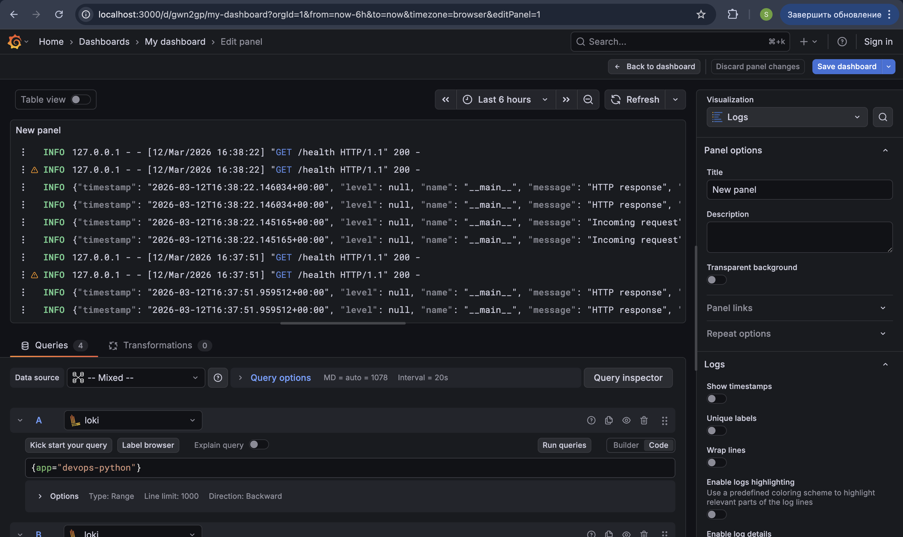

# Lab 7 — Observability & Logging with Loki Stack

## Architecture

The logging system consists of the following components:

```
┌─────────────┐
│   Python    │
│  Application │────┐
└─────────────┘    │
                  │ Logs (JSON)
┌─────────────┐   │    ┌──────────┐
│   Go App    │───┼───▶│ Promtail │
└─────────────┘   │    └──────────┘
                  │         │
┌─────────────┐   │         │ Push logs
│  Containers │───┘         ▼
└─────────────┘         ┌──────────┐
                        │   Loki   │
                        │  (TSDB)  │
                        └──────────┘
                             │
                             │ Query
                             ▼
                        ┌──────────┐
                        │  Grafana │
                        │ (UI/API) │
                        └──────────┘
```

### Components:

1. **Loki 3.0** — Log storage with TSDB index
   - Port: 3100
   - Retention: 7 days (168 hours)
   - Index: TSDB (10x faster than boltdb-shipper)

2. **Promtail 3.0** — Log collector
   - Port: 9080
   - Service Discovery: Docker containers
   - Filtering: Only containers with `logging=promtail` label

3. **Grafana 12.3.1** — Visualization
   - Port: 3000
   - Data Source: Loki
   - Dashboards: Interactive panels with LogQL queries

4. **Applications**:
   - Python app (port 8000) — JSON logging
   - Go app (port 8001) — Bonus application

---

## Setup Guide

### Prerequisites

- Docker and Docker Compose v2
- Python 3.11+ (for local development)
- ~2GB free disk space

### Step 1: Project Structure Preparation

The structure is already created:
```
monitoring/
├── docker-compose.yml
├── loki/
│   └── config.yml
├── promtail/
│   └── config.yml
└── docs/
    └── LAB07.md
```

### Step 2: Start the Stack

```bash
cd monitoring
docker compose up -d
```

Check status:
```bash
docker compose ps
```

All services should be in `healthy` or `running` status.

### Step 3: Verify Services

**Loki:**
```bash
curl http://localhost:3100/ready
# Should return: ready
```

**Promtail:**
```bash
curl http://localhost:9080/targets
# Shows discovered containers
```

**Grafana:**
```bash
open http://localhost:3000
# Or in browser: http://localhost:3000
```

### Step 4: Configure Grafana Data Source

1. Open Grafana: http://localhost:3000
2. Go to **Connections** → **Data sources** → **Add data source**
3. Select **Loki**
4. URL: `http://loki:3100`
5. Click **Save & Test**
6. Should show: "Data source connected"

### Step 5: Generate Logs

```bash
# Generate traffic to create logs
for i in {1..20}; do curl http://localhost:8000/; done
for i in {1..20}; do curl http://localhost:8000/health; done

# Check logs in Grafana Explore
# Query: {app="devops-python"}
```

---

## Configuration

### Loki Configuration (`loki/config.yml`)

**Key settings:**

- **TSDB Index**: Used for fast queries (Loki 3.0+)
- **Schema v13**: Modern storage schema
- **Retention**: 7 days (168 hours)
- **Compactor**: Automatic cleanup of old logs

```yaml
schema_config:
  configs:
    - from: 2024-01-01
      store: tsdb
      object_store: filesystem
      schema: v13

limits_config:
  retention_period: 168h
```

**Why TSDB?**
- Up to 10x faster queries compared to boltdb-shipper
- Lower memory usage
- Better data compression

### Promtail Configuration (`promtail/config.yml`)

**Key settings:**

- **Docker Service Discovery**: Automatic container discovery
- **Filtering**: Only containers with `logging=promtail`
- **Relabeling**: Extract container name and app label

```yaml
scrape_configs:
  - job_name: docker
    docker_sd_configs:
      - host: unix:///var/run/docker.sock
        refresh_interval: 5s
    relabel_configs:
      - source_labels: [__meta_docker_container_label_logging]
        regex: promtail
        action: keep
```

**How filtering works:**
1. Promtail scans Docker socket every 5 seconds
2. Finds all containers
3. Filters only those with `logging=promtail` label
4. Extracts container name and app label
5. Sends logs to Loki with these labels

### Docker Compose Configuration

**Networks:**
- All services in `logging-network` for internal communication

**Volumes:**
- `loki-data`: Loki data (chunks, TSDB index)
- `grafana-data`: Grafana configuration and dashboards
- `promtail-positions`: Log reading positions

**Resource Limits:**
- Loki: 1 CPU, 1GB RAM
- Grafana: 1 CPU, 1GB RAM
- Promtail: 0.5 CPU, 512MB RAM
- Apps: 0.5 CPU, 512MB RAM each

---

## Application Logging

### Implementation

Used `python-json-logger` library for structured logging.

**Added to `requirements.txt`:**
```
python-json-logger==3.2.1
```

**Configuration in `app.py`:**
```python
from pythonjsonlogger import jsonlogger

logHandler = logging.StreamHandler()
formatter = jsonlogger.JsonFormatter(
    '%(timestamp)s %(level)s %(name)s %(message)s',
    timestamp=True
)
logHandler.setFormatter(formatter)
logger = logging.getLogger(__name__)
logger.addHandler(logHandler)
```

### Logged Events

1. **Application startup:**
```json
{
  "timestamp": "2024-01-15T10:00:00Z",
  "level": "INFO",
  "event": "app_startup",
  "host": "0.0.0.0",
  "port": 5000
}
```

2. **HTTP requests:**
```json
{
  "timestamp": "2024-01-15T10:01:00Z",
  "level": "INFO",
  "event": "http_request",
  "method": "GET",
  "path": "/",
  "client_ip": "172.18.0.1"
}
```

3. **HTTP responses:**
```json
{
  "timestamp": "2024-01-15T10:01:00Z",
  "level": "INFO",
  "event": "http_response",
  "method": "GET",
  "path": "/",
  "status_code": 200,
  "duration_ms": 12.5
}
```

4. **Errors:**
```json
{
  "timestamp": "2024-01-15T10:02:00Z",
  "level": "ERROR",
  "event": "http_error",
  "error_code": 500,
  "error_type": "ValueError",
  "path": "/error"
}
```

### Benefits of JSON Logging

- **Structured**: Easy to parse and filter
- **Field extraction**: Can be used in LogQL queries
- **Context**: Each event contains all necessary information
- **Aggregation**: Easy to build metrics from logs

---

## Grafana Dashboard

### Dashboard Panels

#### 1. Logs Table (Logs visualization)

**Query:**
```logql
{app=~"devops-.*"}
```

**Description:** Shows all logs from devops-python and devops-go applications.

**Settings:**
- Visualization: Logs
- Time range: Last 15 minutes
- Show: Time, Labels, Message

#### 2. Request Rate (Time series graph)

**Query:**
```logql
sum by (app) (rate({app=~"devops-.*"} [1m]))
```

**Description:** Graph showing requests per second for each application.

**Settings:**
- Visualization: Time series
- Unit: req/s (requests per second)
- Legend: {{app}}

#### 3. Error Logs (Logs visualization)

**Query:**
```logql
{app=~"devops-.*"} | json | level="ERROR"
```

**Description:** Only ERROR level logs from all applications.

**Settings:**
- Visualization: Logs
- JSON parsing to extract `level` field
- Filter by `level="ERROR"`

#### 4. Log Level Distribution (Stat panel)

**Query:**
```logql
sum by (level) (count_over_time({app=~"devops-.*"} | json [5m]))
```

**Description:** Count of logs by level (INFO, ERROR, WARNING) over the last 5 minutes.

**Settings:**
- Visualization: Stat
- Value options: Show all values
- Color mode: Value

### LogQL Queries — Explanation

**1. Stream Selector:**
```logql
{app="devops-python"}
```
Selects log stream with label `app=devops-python`.

**2. Regex Selector:**
```logql
{app=~"devops-.*"}
```
Selects all streams where `app` starts with `devops-`.

**3. Line Filter:**
```logql
{app="devops-python"} |= "error"
```
Filters lines containing "error" (case-insensitive).

**4. JSON Parser:**
```logql
{app="devops-python"} | json
```
Parses JSON logs and extracts fields.

**5. Field Filter:**
```logql
{app="devops-python"} | json | level="ERROR"
```
After JSON parsing, filters by `level` field.

**6. Rate Aggregation:**
```logql
rate({app="devops-python"}[1m])
```
Calculates logs per second over the last minute.

**7. Count Over Time:**
```logql
count_over_time({app="devops-python"}[5m])
```
Counts number of logs over the last 5 minutes.

**8. Sum by Label:**
```logql
sum by (level) (count_over_time({app=~"devops-.*"} | json [5m]))
```
Groups by `level` label and sums.

### How to Create Dashboard

1. **Create new dashboard:**
   - Dashboard → New → New Dashboard
   - Add visualization

2. **Add panel:**
   - Select Loki data source
   - Enter LogQL query
   - Choose visualization type
   - Configure panel options

3. **Save:**
   - Name dashboard: "Application Logs"
   - Save (Grafana 11+ auto-saves drafts)

---

## Production Configuration

### Security

**Grafana:**
- Anonymous access disabled (for production)
- Password via environment variable
- Use `.env` file for secrets

**Example `.env`:**
```bash
GRAFANA_ADMIN_PASSWORD=secure_password_here
```

**Update docker-compose.yml:**
```yaml
environment:
  - GF_AUTH_ANONYMOUS_ENABLED=false
  - GF_SECURITY_ADMIN_PASSWORD=${GRAFANA_ADMIN_PASSWORD}
```

**⚠️ Important:** Do not commit `.env` to git! Add to `.gitignore`.

### Resource Limits

All services have resource constraints:

```yaml
deploy:
  resources:
    limits:
      cpus: '1.0'
      memory: 1G
    reservations:
      cpus: '0.5'
      memory: 512M
```

**Why this matters:**
- Prevents host resource exhaustion
- Guarantees minimum resources for operation
- Helps plan infrastructure

### Health Checks

All services have health checks:

**Loki:**
```yaml
healthcheck:
  test: ["CMD-SHELL", "wget --no-verbose --tries=1 --spider http://localhost:3100/ready || exit 1"]
  interval: 10s
  timeout: 5s
  retries: 5
  start_period: 10s
```

**Grafana:**
```yaml
healthcheck:
  test: ["CMD-SHELL", "wget --no-verbose --tries=1 --spider http://localhost:3000/api/health || exit 1"]
  interval: 10s
  timeout: 5s
  retries: 5
  start_period: 30s
```

**Health check verification:**
```bash
docker compose ps
# All services should show "healthy"
```

### Retention Policy

**Configuration:** 7 days (168 hours)

**Loki configuration:**
```yaml
limits_config:
  retention_period: 168h

compactor:
  retention_enabled: true
  retention_delete_delay: 2h
```

**How it works:**
1. Compactor periodically checks old data
2. Deletes data older than retention_period
3. Deletion delay (retention_delete_delay) prevents accidental deletion

**Changing retention:**
- For longer storage: increase `retention_period`
- Account for increased disk usage
- Configure disk space monitoring

---

## Testing

### Stack Verification

**1. Service check:**
```bash
cd monitoring
docker compose ps
```

Expected output:
```
NAME          STATUS          PORTS
loki          healthy         0.0.0.0:3100->3100/tcp
promtail      running         0.0.0.0:9080->9080/tcp
grafana       healthy         0.0.0.0:3000->3000/tcp
app-python    healthy         0.0.0.0:8000->5000/tcp
app-go        healthy         0.0.0.0:8001->8080/tcp
```

**2. Loki check:**
```bash
curl http://localhost:3100/ready
# Response: ready

curl http://localhost:3100/metrics
# Should show Loki metrics
```

**3. Promtail check:**
```bash
curl http://localhost:9080/targets
# Should discover app-python and app-go containers
```

**4. Grafana check:**
```bash
curl http://localhost:3000/api/health
# Response: {"commit":"...","database":"ok","version":"12.3.1"}
```

### Test Log Generation

```bash
# Generate traffic
for i in {1..50}; do
  curl http://localhost:8000/
  curl http://localhost:8000/health
  sleep 0.1
done

# Check logs in Grafana Explore
# Query: {app="devops-python"}
```

### LogQL Query Testing

**In Grafana Explore:**

1. **All logs:**
```logql
{app="devops-python"}
```

2. **Errors only:**
```logql
{app="devops-python"} |= "ERROR"
```

3. **JSON parsing:**
```logql
{app="devops-python"} | json
```

4. **Field filter:**
```logql
{app="devops-python"} | json | level="ERROR"
```

5. **Metrics:**
```logql
rate({app="devops-python"}[1m])
```

6. **Grouping:**
```logql
sum by (level) (count_over_time({app="devops-python"} | json [5m]))
```

### Dashboard Verification

1. Open dashboard in Grafana
2. Verify all 4 panels show data
3. Update time range
4. Verify queries work correctly

---

## Challenges & Solutions

### Issue 1: Promtail doesn't see containers

**Symptoms:**
- `curl http://localhost:9080/targets` shows empty list
- Logs don't appear in Grafana

**Solution:**
1. Check containers have `logging=promtail` label
2. Check Docker socket access: `/var/run/docker.sock`
3. Restart Promtail: `docker compose restart promtail`

### Issue 2: Loki doesn't accept logs

**Symptoms:**
- Promtail shows connection errors
- Logs aren't saved

**Solution:**
1. Check Loki is running: `docker compose ps loki`
2. Check network: `docker network inspect logging-network`
3. Check Loki logs: `docker compose logs loki`

### Issue 3: Grafana doesn't connect to Loki

**Symptoms:**
- "Data source connected" doesn't appear
- Explore queries don't work

**Solution:**
1. Check URL: should be `http://loki:3100` (not localhost!)
2. Check both services are in same network
3. Check Grafana logs: `docker compose logs grafana`

### Issue 4: JSON logs don't parse

**Symptoms:**
- Query `| json` doesn't work
- Fields aren't extracted

**Solution:**
1. Check log format: should be valid JSON
2. Check `python-json-logger` is used
3. Check application logs: `docker compose logs app-python`

### Issue 5: High disk usage

**Symptoms:**
- Disk fills up quickly
- Loki uses a lot of space

**Solution:**
1. Check retention policy: should be configured
2. Reduce retention_period if needed
3. Check compactor: `docker compose logs loki | grep compactor`

---

## Evidence

### Screenshots

1. **Grafana Dashboard with all panels:**
   
   - Shows logs from all applications
   - Displays all 4 required panels

2. **Grafana Explore with logs:**
   - Shows logs from at least 3 containers
   - Query: `{job="docker"}`

3. **JSON logs from application:**
   - Shows structured JSON logs
   - Visible fields: timestamp, level, event, method, path

4. **Dashboard panels:**
   - Logs Table
   - Request Rate graph
   - Error Logs
   - Log Level Distribution

5. **Health checks:**
   - `docker compose ps` shows all services healthy

6. **Grafana login page:**
   - For production: shows login form (no anonymous access)

### Verification Commands

```bash
# Check all services
docker compose ps

# Check Loki logs
docker compose logs loki | tail -20

# Check Promtail logs
docker compose logs promtail | tail -20

# Check application logs
docker compose logs app-python | tail -20

# Check Loki metrics
curl http://localhost:3100/metrics | grep loki

# Check Promtail targets
curl http://localhost:9080/targets | jq .
```

---

## Conclusions

### What Was Learned

1. **Loki 3.0 with TSDB:**
   - Logging system architecture
   - TSDB index advantages
   - Retention policy configuration

2. **Promtail:**
   - Docker service discovery
   - Relabeling for labels
   - Container filtering

3. **LogQL:**
   - Stream selectors
   - Line filters
   - JSON parsing
   - Aggregations and metrics

4. **Grafana:**
   - Dashboard creation
   - Working with Loki data source
   - Log visualization

5. **Production practices:**
   - Resource limits
   - Health checks
   - Security configuration
   - Retention policies

### Practical Applications

This logging system can be used for:
- Production application monitoring
- Problem debugging
- Performance analysis
- Security auditing
- Compliance and reporting

### Next Steps

- Lab 8: Add Prometheus for metrics
- Lab 16: Kubernetes monitoring with full observability stack

---

**Completion Date:** 2024-01-15  
**Versions:**
- Loki: 3.0.0
- Promtail: 3.0.0
- Grafana: 12.3.1
- Docker Compose: v2
