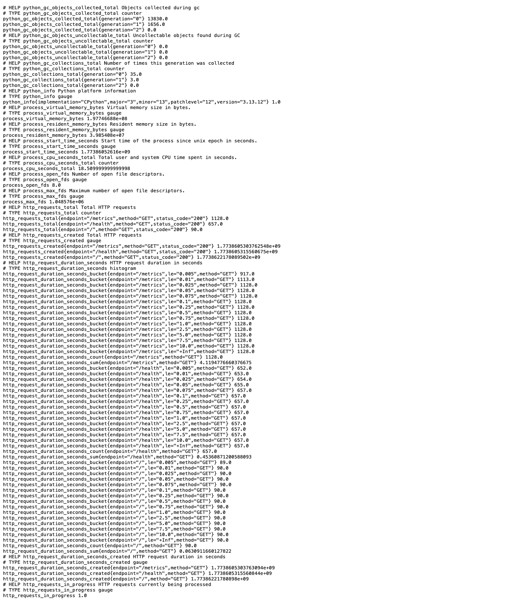
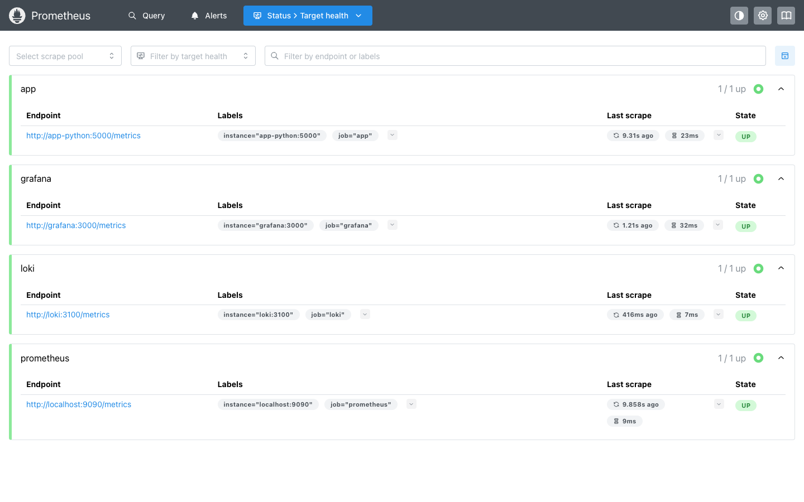
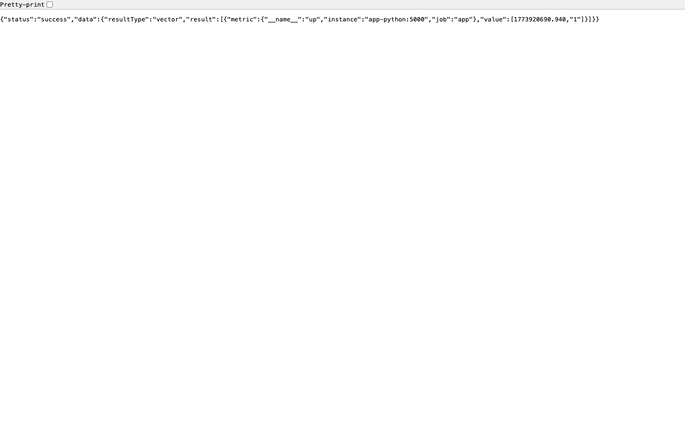
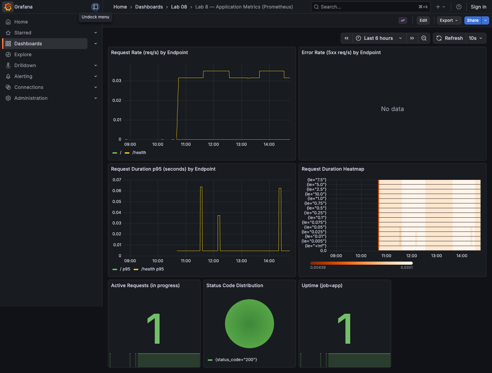

# Lab 8 — Metrics & Monitoring with Prometheus

## Architecture
The metrics flow is shown below:

```text
┌───────────────────────┐
│ Python app (Flask)    │
│ /metrics (Prom format)│
└───────────┬───────────┘
            │ scrape (pull)
            ▼
┌───────────────────────┐
│ Prometheus             │
│ /targets, /api/*       │
└───────────┬───────────┘
            │ datasource
            ▼
┌───────────────────────┐
│ Grafana               │
│ Dashboard (App Metrics)│
└───────────────────────┘
```

## Application Instrumentation
Changes were made in `app_python/app.py`:

A `GET /metrics` endpoint was added to expose metrics in Prometheus text format.

The following metrics were added (labels are intentionally low-cardinality because this app has no path parameters):
- `http_requests_total{method, endpoint, status_code}` (Counter)
  - increments on every HTTP response (including errors);
  - `endpoint` is taken from `request.path`.
- `http_request_duration_seconds{method, endpoint}` (Histogram)
  - measures request duration in seconds;
  - observations are recorded in `after_request`.
- `http_requests_in_progress` (Gauge)
  - shows the number of requests currently being processed (via `Gauge.track_inprogress()`).

How metrics are integrated into the app:
- `@app.before_request`: starts the timer and enables `track_inprogress`.
- `@app.after_request`: increments Counter, records Histogram observation, disables in-progress gauge.

## Prometheus Configuration
Configuration file: `monitoring/prometheus/prometheus.yml`

Main settings:
- `scrape_interval: 15s`
- retention:
  - `retention_time: 15d`
  - `retention_size: 10GB`

Scrape targets (job -> host:port):
- `prometheus` -> `localhost:9090` (self-scrape)
- `app` -> `app-python:5000` (path `/metrics`)
- `loki` -> `loki:3100` (path `/metrics`)
- `grafana` -> `grafana:3000` (path `/metrics`)

Port `5000` is used because the `app-python` container listens on `PORT=5000`, while `8000:5000` is mapped externally in compose.

## Dashboard Walkthrough
Prepared dashboard JSON: `monitoring/docs/dashboard-lab08-app-metrics.json`

Instructions:
1. In Grafana: **Connections → Data sources → Add data source → Prometheus**
2. URL: `http://prometheus:9090`
3. Import the dashboard JSON (Dashboard → New → Import).

Panels (name -> purpose -> PromQL):
1. `Request Rate (req/s) by Endpoint`
   - `sum by (endpoint) (rate(http_requests_total{endpoint!="/metrics"}[5m]))`
2. `Error Rate (5xx req/s) by Endpoint`
   - `sum by (endpoint) (rate(http_requests_total{status_code=~"5..", endpoint!="/metrics"}[5m]))`
3. `Request Duration p95 (seconds) by Endpoint`
   - `histogram_quantile(0.95, sum by (le, endpoint) (rate(http_request_duration_seconds_bucket{endpoint!="/metrics"}[5m])))`
4. `Request Duration Heatmap`
   - `sum by (le) (rate(http_request_duration_seconds_bucket{endpoint!="/metrics"}[5m]))`
5. `Active Requests (in progress)`
   - `http_requests_in_progress`
6. `Status Code Distribution`
   - `sum by (status_code) (rate(http_requests_total{endpoint!="/metrics"}[5m]))`
7. `Uptime (job=app)`
   - `up{job="app"}`

## PromQL Examples
Example queries below (all use the `endpoint` label and exclude `"/metrics"`):
1. Requests/sec by endpoint:
   - `sum by (endpoint) (rate(http_requests_total{endpoint!="/metrics"}[5m]))`
2. 5xx requests/sec by endpoint:
   - `sum by (endpoint) (rate(http_requests_total{status_code=~"5..", endpoint!="/metrics"}[5m]))`
3. p95 latency (seconds) by endpoint:
   - `histogram_quantile(0.95, sum by (le, endpoint) (rate(http_request_duration_seconds_bucket{endpoint!="/metrics"}[5m])))`
4. Current in-progress requests:
   - `http_requests_in_progress`
5. Status code distribution over 5 minutes:
   - `sum by (status_code) (rate(http_requests_total{endpoint!="/metrics"}[5m]))`
6. App uptime:
   - `up{job="app"}`

## Production Setup
### Health Checks
`monitoring/docker-compose.yml`:
- Prometheus:
  - check `http://localhost:9090/-/healthy`
- Python app:
  - check `http://localhost:5000/health` (inside the `app-python` container)

Other health checks (Loki/Grafana) were already present from Lab 7.

### Resource Limits
Compose includes limits/reservations:
- Prometheus: `memory 1G`, `cpus 1.0`
- Loki/Grafana/app-python: already configured in Lab 7 (logic unchanged).

### Data Retention
Retention is configured in `monitoring/prometheus/prometheus.yml` (15 days / 10GB).

### Persistent Volumes
Added volume `prometheus-data`:
- `prometheus-data:/prometheus` in the Prometheus service

## Testing Results
What to verify and capture:
1. Start the stack:
   - `cd DevOps-Core-Course/monitoring`
   - `docker compose up -d`
2. Verify Prometheus:
   - `http://localhost:9090/targets` — all targets should be `UP` (screenshot)
   - `http://localhost:9090` and query `up` (screenshot)
3. Verify app metrics:
   - `curl http://localhost:8000/metrics` (output screenshot)
4. Verify Grafana:
   - Dashboard `Lab 8 — Application Metrics` (panel screenshots)

Screenshots:
- `monitoring/evidence/lab08/01-app-metrics.png` — `GET /metrics` output (Prometheus format)
  
- `monitoring/evidence/lab08/02-prometheus-targets.png` — `Prometheus /targets` page with `UP` targets
  
- `monitoring/evidence/lab08/03-prometheus-query-up.png` — PromQL result `up{job="app"}`
  
- `monitoring/evidence/lab08/04-grafana-dashboard.png` — dashboard `Lab 8 — Application Metrics (Prometheus)`
  

## Challenges & Solutions
1. Host/container port mismatch
   - Compose exposes port `8000`, but the container listens on `5000`.
   - Therefore, `prometheus.yml` uses scrape target `app-python:5000`.
2. Metric labels vs PromQL
   - The app uses `status_code` instead of `status` (as in some guideline examples).
   - Therefore, all PromQL in dashboard/docs uses `status_code`.

